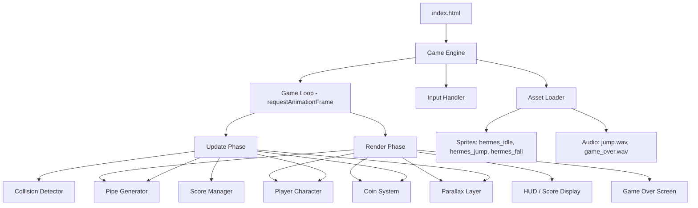
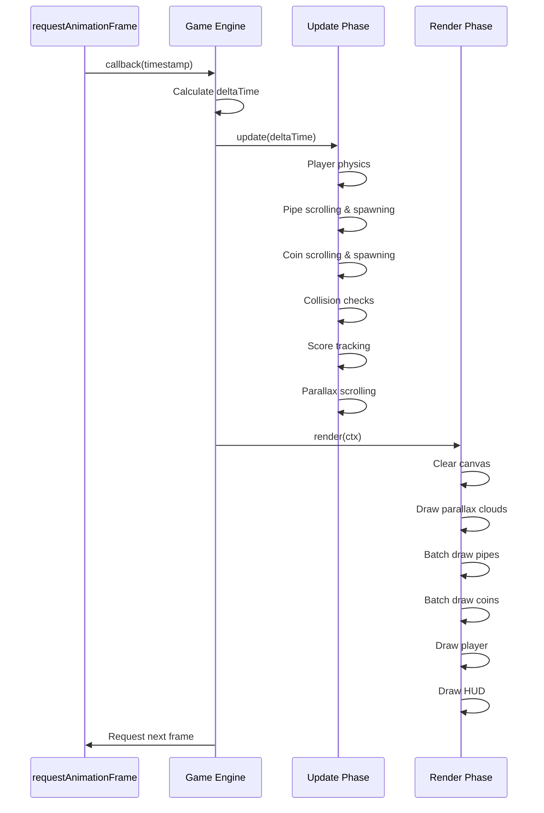
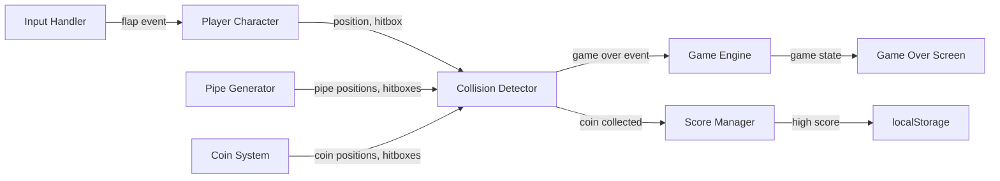

# Design Document: Flappy Kiro

## Overview

Flappy Kiro is a retro-styled endless side-scroller built entirely with vanilla HTML5 Canvas and JavaScript. The architecture prioritizes simplicity, performance (60 FPS target), and readability for workshop participants. The game uses a single-file entry point with modular ES6 classes, a fixed-timestep game loop, object pooling for pipes and coins, and hitbox-based collision detection.

The design follows a component-based architecture where each game subsystem (player physics, pipe generation, coin spawning, collision, scoring, parallax) is encapsulated in its own class. A central Game Engine orchestrates the loop, delegates updates, and batches rendering calls by sprite type.

## Architecture

### High-Level Architecture



### Game Loop Flow



### Data Flow



## Components and Interfaces

### 1. Game Engine (`GameEngine`)

The central orchestrator that owns the canvas context, manages game state, and drives the loop.

```javascript
class GameEngine {
  constructor(canvasId)
  
  // Lifecycle
  init()              // Load assets, initialize subsystems
  start()             // Begin game loop
  reset()             // Reset all state for new game
  stop()              // Halt loop on game over
  
  // Loop
  loop(timestamp)     // Main RAF callback
  update(dt)          // Delegate updates to subsystems
  render(ctx)         // Delegate rendering in correct order
  
  // State
  state               // 'loading' | 'ready' | 'playing' | 'gameover'
  canvas              // HTMLCanvasElement
  ctx                 // CanvasRenderingContext2D
  lastTimestamp       // Previous frame timestamp
  scrollSpeed         // Pixels per second (horizontal scroll)
}
```

### 2. Asset Loader (`AssetLoader`)

Preloads all images and audio before game start.

```javascript
class AssetLoader {
  constructor(manifest)
  
  loadAll()           // Returns Promise<void> when all assets ready
  getImage(key)       // Retrieve loaded Image by key
  getAudio(key)       // Retrieve loaded Audio by key
  
  // Manifest format: { images: { key: path }, audio: { key: path } }
}
```

### 3. Input Handler (`InputHandler`)

Captures keyboard and touch events, exposes a clean interface.

```javascript
class InputHandler {
  constructor(canvas)
  
  onFlap(callback)    // Register flap listener
  enable()            // Start listening
  disable()           // Stop listening (game over)
  
  // Listens for: spacebar keydown, canvas touchstart, canvas click
}
```

### 4. Player Character (`Player`)

Manages player physics (gravity, flap velocity) and sprite state.

```javascript
class Player {
  constructor(x, y, sprites)
  
  flap()              // Apply upward velocity
  update(dt)          // Apply gravity, update position
  getHitbox()         // Returns reduced bounding box {x, y, w, h}
  getSpriteState()    // Returns 'idle' | 'jump' | 'fall'
  render(ctx)         // Draw current sprite
  reset()             // Reset to initial position/velocity
  
  // Physics constants
  static GRAVITY      // Pixels/sec²
  static FLAP_VELOCITY // Negative pixels/sec (upward)
  static IDLE_THRESHOLD // Velocity threshold for idle state
}
```

### 5. Pipe Generator (`PipeGenerator`)

Spawns, scrolls, recycles pipe pairs using an object pool.

```javascript
class PipeGenerator {
  constructor(canvasWidth, canvasHeight, gapSize)
  
  update(dt, scrollSpeed)   // Scroll pipes, spawn new, recycle off-screen
  getActivePipes()          // Returns array of active pipe pairs
  render(ctx)               // Batch render all active pipes
  reset()                   // Return all pipes to pool
  
  // Object Pool
  pool                      // Array of pre-allocated PipePair objects
  activePipes               // Array of currently visible pipe pairs
  
  spawnInterval             // Horizontal distance between spawns
  lastSpawnX                // Track spawn timing by distance
}

class PipePair {
  active                    // Boolean - in use or pooled
  x                         // Horizontal position
  gapY                      // Center Y of the gap
  gapSize                   // Vertical gap size
  width                     // Pipe width in pixels
  
  getTopHitbox()            // {x, y, w, h} for top pipe
  getBottomHitbox()         // {x, y, w, h} for bottom pipe
  render(ctx)               // Draw both pipes with retro style
  reset(x, gapY)           // Reactivate with new position
}
```

### 6. Coin System (`CoinSystem`)

Spawns, scrolls, recycles coins using an object pool.

```javascript
class CoinSystem {
  constructor(canvasWidth, canvasHeight)
  
  update(dt, scrollSpeed)   // Scroll coins, spawn new, recycle off-screen
  getActiveCoins()          // Returns array of active coins
  collect(coin)             // Mark coin as collected, trigger animation
  render(ctx)               // Batch render all active coins
  reset()                   // Return all coins to pool
  
  // Object Pool
  pool                      // Array of pre-allocated Coin objects
  activeCoins               // Array of currently visible coins
}

class Coin {
  active                    // Boolean - in use or pooled
  x                         // Horizontal position
  y                         // Vertical position
  collected                 // Boolean - collection animation in progress
  animationTimer            // Countdown for collection effect
  
  getHitbox()               // {x, y, w, h}
  render(ctx)               // Draw coin (golden circle with shine)
  reset(x, y)              // Reactivate with new position
}
```

### 7. Collision Detector (`CollisionDetector`)

Pure logic module that checks hitbox intersections.

```javascript
class CollisionDetector {
  // Static utility - no state
  static checkAABB(a, b)              // Returns boolean: do two hitboxes overlap?
  static checkPlayerPipes(player, pipes)   // Returns boolean: player hit any pipe?
  static checkPlayerCoins(player, coins)   // Returns array of collected coins
  static checkFloor(player, floorY)        // Returns boolean: player hit floor?
  static checkCeiling(player)              // Returns boolean: player above canvas?
  
  // Hitbox format: { x, y, w, h }
  // Reduced hitbox: shrink by ~20% for forgiving feel
}
```

### 8. Score Manager (`ScoreManager`)

Tracks coins, distance, and persists high scores.

```javascript
class ScoreManager {
  constructor(storageKey)
  
  addCoin()                 // Increment coin count
  updateDistance(dt, speed) // Accumulate distance in meters
  getScore()               // Returns { coins, distance, highScore }
  checkHighScore()         // Compare and persist if new high
  reset()                  // Reset session scores (keep high score)
  
  // Persistence
  loadHighScore()          // Read from localStorage
  saveHighScore()          // Write to localStorage
  
  coins                    // Current session coin count
  distance                 // Current session distance (meters)
  highScore                // Best score from localStorage
  storageKey               // localStorage key name
}
```

### 9. Parallax Layer (`ParallaxLayer`)

Renders scrolling cloud layers at different depths.

```javascript
class ParallaxLayer {
  constructor(canvasWidth, canvasHeight, layerConfigs)
  
  update(dt)               // Scroll each layer at its own speed
  render(ctx)              // Draw all cloud layers (back to front)
  reset()                  // Reset positions
  
  // layerConfigs: [{ speed, opacity, count, sizeRange }]
  layers                   // Array of cloud layer data
}
```

### 10. Game Over Screen (`GameOverScreen`)

Overlay rendered on top of the frozen game state.

```javascript
class GameOverScreen {
  constructor(canvasWidth, canvasHeight)
  
  show(scoreData)          // Display with final scores
  hide()                   // Remove overlay
  render(ctx)              // Draw overlay, scores, restart prompt
  isVisible                // Boolean
}
```

## Data Models

### Game State

```javascript
// Central game state enum
const GameState = {
  LOADING: 'loading',
  READY: 'ready',
  PLAYING: 'playing',
  GAME_OVER: 'gameover'
};
```

### Hitbox

```javascript
// All collision entities use this format
// { x: number, y: number, w: number, h: number }
// x, y = top-left corner; w, h = dimensions
```

### Score Data

```javascript
// Passed to Game Over Screen
// { coins: number, distance: number, highScore: number }
```

### Asset Manifest

```javascript
const ASSET_MANIFEST = {
  images: {
    hermes_idle: 'kiro-introduction-starter-kit/assets/hermes_idle.png',
    hermes_jump: 'kiro-introduction-starter-kit/assets/hermes_jump.png',
    hermes_fall: 'kiro-introduction-starter-kit/assets/hermes_fall.png'
  },
  audio: {
    jump: 'kiro-introduction-starter-kit/assets/jump.wav',
    gameOver: 'kiro-introduction-starter-kit/assets/game_over.wav'
  }
};
```

### Game Configuration Constants

```javascript
const CONFIG = {
  CANVAS_WIDTH: 480,
  CANVAS_HEIGHT: 640,
  GRAVITY: 980,                // px/sec²
  FLAP_VELOCITY: -320,        // px/sec (upward)
  SCROLL_SPEED: 150,          // px/sec
  PIPE_WIDTH: 60,             // px
  PIPE_GAP: 150,              // px vertical gap
  PIPE_SPAWN_INTERVAL: 250,   // px horizontal distance between pipes
  PIPE_POOL_SIZE: 8,          // Pre-allocated pipe pairs
  COIN_POOL_SIZE: 12,         // Pre-allocated coins
  COIN_RADIUS: 12,            // px
  HITBOX_SHRINK: 0.2,         // 20% reduction for forgiving collisions
  PLAYER_WIDTH: 48,           // px
  PLAYER_HEIGHT: 48,          // px
  FLOOR_Y: 600,               // px from top
  DISTANCE_SCALE: 0.01,       // Convert px to meters
  STORAGE_KEY: 'flappy-kiro-highscore'
};
```

### File Structure

```
flappy-kiro/
├── index.html                 # Entry point, canvas element, minimal CSS
├── js/
│   ├── main.js               # Bootstrap, create GameEngine instance
│   ├── GameEngine.js          # Core loop, state management
│   ├── AssetLoader.js         # Preload images and audio
│   ├── InputHandler.js        # Keyboard/touch input
│   ├── Player.js              # Player physics and rendering
│   ├── PipeGenerator.js       # Pipe spawning, pooling, rendering
│   ├── CoinSystem.js          # Coin spawning, pooling, rendering
│   ├── CollisionDetector.js   # AABB collision checks
│   ├── ScoreManager.js        # Score tracking and persistence
│   ├── ParallaxLayer.js       # Cloud background layers
│   ├── GameOverScreen.js      # Game over overlay
│   └── config.js             # All constants and configuration
└── kiro-introduction-starter-kit/
    └── assets/                # Sprites and audio (existing)
```


## Correctness Properties

*A property is a characteristic or behavior that should hold true across all valid executions of a system—essentially, a formal statement about what the system should do. Properties serve as the bridge between human-readable specifications and machine-verifiable correctness guarantees.*

### Property 1: Gravity applies consistent acceleration

*For any* positive deltaTime value and any initial player velocity, calling `update(dt)` without a preceding flap SHALL increase the player's downward velocity by exactly `GRAVITY * dt` and update position accordingly.

**Validates: Requirements 2.2**

### Property 2: Sprite state reflects velocity

*For any* player velocity value, `getSpriteState()` SHALL return `'jump'` when velocity < -IDLE_THRESHOLD, `'idle'` when velocity is within [-IDLE_THRESHOLD, IDLE_THRESHOLD], and `'fall'` when velocity > IDLE_THRESHOLD.

**Validates: Requirements 2.3, 2.4, 2.5**

### Property 3: Pipes spawn at regular intervals

*For any* sequence of updates whose cumulative scroll distance crosses a spawn interval boundary, the PipeGenerator SHALL produce exactly one new active pipe pair per boundary crossed.

**Validates: Requirements 3.1**

### Property 4: Pipe pairs have valid gap position and size

*For any* spawned pipe pair, the gap center Y SHALL be within playable bounds [minGapY, maxGapY], and the vertical distance between the top pipe's bottom edge and the bottom pipe's top edge SHALL equal PIPE_GAP.

**Validates: Requirements 3.2, 3.3**

### Property 5: Pipes scroll at constant speed

*For any* positive deltaTime and any active pipe, after `update(dt, scrollSpeed)`, the pipe's x position SHALL decrease by exactly `scrollSpeed * dt`.

**Validates: Requirements 3.4**

### Property 6: Off-screen pipes are recycled

*For any* pipe whose `x + width < 0` after an update, the pipe SHALL be deactivated and returned to the object pool.

**Validates: Requirements 3.5**

### Property 7: Coins are positioned in safe areas

*For any* spawned coin, its position SHALL not overlap with any active pipe hitbox.

**Validates: Requirements 4.1**

### Property 8: Coins scroll at constant speed

*For any* positive deltaTime and any active coin, after `update(dt, scrollSpeed)`, the coin's x position SHALL decrease by exactly `scrollSpeed * dt`.

**Validates: Requirements 4.5**

### Property 9: AABB collision detection correctness

*For any* two axis-aligned bounding boxes A and B, `checkAABB(A, B)` SHALL return `true` if and only if the boxes share a non-zero area (A.x < B.x + B.w AND A.x + A.w > B.x AND A.y < B.y + B.h AND A.y + A.h > B.y).

**Validates: Requirements 5.1**

### Property 10: Floor collision detection

*For any* player position where `y + height >= FLOOR_Y`, `checkFloor(player, FLOOR_Y)` SHALL return `true`, and for any position where `y + height < FLOOR_Y`, it SHALL return `false`.

**Validates: Requirements 5.2**

### Property 11: Ceiling position clamping

*For any* player whose y position is less than 0 after a physics update, the player's y position SHALL be clamped to 0 and upward velocity set to 0.

**Validates: Requirements 5.3**

### Property 12: Hitbox reduction for fair collisions

*For any* player sprite dimensions (width, height), `getHitbox()` SHALL return a hitbox with dimensions `width * (1 - HITBOX_SHRINK)` by `height * (1 - HITBOX_SHRINK)`, centered on the sprite.

**Validates: Requirements 5.4**

### Property 13: Distance accumulation

*For any* positive deltaTime and scrollSpeed, calling `updateDistance(dt, speed)` SHALL increase the stored distance by exactly `speed * dt * DISTANCE_SCALE`.

**Validates: Requirements 6.2**

### Property 14: High score persistence round-trip

*For any* numeric score value, saving it via `saveHighScore()` and then calling `loadHighScore()` SHALL return the same value. Additionally, `checkHighScore()` SHALL only update the stored value when the current score exceeds the previously stored high score.

**Validates: Requirements 6.4, 6.5**

### Property 15: Game reset restores initial state

*For any* game state (arbitrary scores, player positions, active pipes/coins), calling `reset()` SHALL return all subsystem values to their initial defaults (player at start position, zero velocity, zero score, zero distance, empty active lists).

**Validates: Requirements 7.4**

### Property 16: Parallax layers ordered by speed

*For any* two parallax layers where layer A has greater depth than layer B, layer A's scroll speed SHALL be less than layer B's scroll speed.

**Validates: Requirements 8.2**

### Property 17: Parallax continuous coverage

*For any* amount of elapsed game time, each parallax layer SHALL have at least one cloud sprite visible within the canvas bounds.

**Validates: Requirements 8.3**

### Property 18: Pipe pool size invariant

*For any* sequence of pipe spawn and recycle operations during gameplay, the total number of allocated PipePair objects SHALL never exceed PIPE_POOL_SIZE.

**Validates: Requirements 9.6**

### Property 19: Coin pool size invariant

*For any* sequence of coin spawn and recycle operations during gameplay, the total number of allocated Coin objects SHALL never exceed COIN_POOL_SIZE.

**Validates: Requirements 9.7**

## Error Handling

### Asset Loading Failures

- If any image or audio file fails to load, the AssetLoader SHALL reject its promise with a descriptive error message identifying the failed asset.
- The Game Engine SHALL display a user-friendly error message on the canvas ("Failed to load game assets") rather than silently failing.
- Audio failures SHALL be non-fatal: the game continues without sound if audio cannot be loaded or played (browsers may block autoplay).

### Browser Compatibility

- If `requestAnimationFrame` is unavailable (extremely old browsers), fall back to `setTimeout` with a 16ms interval.
- If `localStorage` is unavailable or throws (private browsing mode in some browsers), the ScoreManager SHALL catch the error and operate with in-memory high score only (no persistence).

### Runtime Errors

- Division by zero in deltaTime calculations: if `dt <= 0` or `dt > 1` (tab was backgrounded), clamp dt to a maximum of `1/30` seconds to prevent physics explosions.
- Object pool exhaustion: if all pool objects are active and a new spawn is needed, skip the spawn rather than allocating new objects. Log a warning to console.

### Input Edge Cases

- Multiple rapid flap inputs: each flap resets velocity to FLAP_VELOCITY regardless of current velocity (no stacking).
- Input during GAME_OVER state: all gameplay inputs are ignored; only restart input is processed.
- Input during LOADING state: all inputs are ignored until assets are loaded.

## Testing Strategy

### Testing Framework

- **Unit tests**: Use a lightweight test runner (e.g., Vitest or Jest) for example-based tests
- **Property-based tests**: Use `fast-check` library for JavaScript property-based testing
- **No browser required for logic tests**: Pure logic components (CollisionDetector, ScoreManager, Player physics, PipeGenerator pool logic) can be tested without DOM

### Property-Based Tests

Each correctness property (Properties 1–19) SHALL be implemented as a property-based test using `fast-check`:

- Minimum **100 iterations** per property test
- Each test tagged with: `Feature: flappy-kiro, Property {number}: {title}`
- Generators for:
  - Positive floats (deltaTime, velocities, positions)
  - Hitboxes (random x, y, w, h with positive dimensions)
  - Score values (non-negative integers)
  - Pipe configurations (random gapY within bounds)

### Unit Tests (Example-Based)

Focus on specific scenarios and integration points:

- **Asset loading**: Verify manifest is correctly processed
- **Input handling**: Verify spacebar/touch triggers flap callback
- **Audio playback**: Verify correct sound is triggered on flap and game over
- **Game state transitions**: LOADING → READY → PLAYING → GAME_OVER → PLAYING (restart)
- **Sprite batching**: Verify render order groups same-type sprites
- **Collection animation**: Verify visual feedback triggers on coin collect

### Edge Case Tests

- Zero deltaTime (no movement)
- Very large deltaTime (clamped to max)
- Player at exact boundary positions (y = 0, y = FLOOR_Y)
- All pool objects active (spawn skipped)
- Empty localStorage (first play)
- Corrupted localStorage value (fallback to 0)

### Integration Tests

- Full game loop cycle: init → start → update → render → game over → restart
- Asset loading with mock fetch/Image
- localStorage read/write cycle

### Test File Structure

```
tests/
├── properties/
│   ├── player.property.test.js      # Properties 1, 2
│   ├── pipes.property.test.js       # Properties 3, 4, 5, 6, 18
│   ├── coins.property.test.js       # Properties 7, 8, 19
│   ├── collision.property.test.js   # Properties 9, 10, 11, 12
│   ├── score.property.test.js       # Properties 13, 14
│   ├── gamestate.property.test.js   # Property 15
│   └── parallax.property.test.js    # Properties 16, 17
├── unit/
│   ├── player.test.js
│   ├── pipeGenerator.test.js
│   ├── coinSystem.test.js
│   ├── collisionDetector.test.js
│   ├── scoreManager.test.js
│   ├── parallaxLayer.test.js
│   ├── assetLoader.test.js
│   └── gameEngine.test.js
└── integration/
    └── gameLoop.test.js
```
